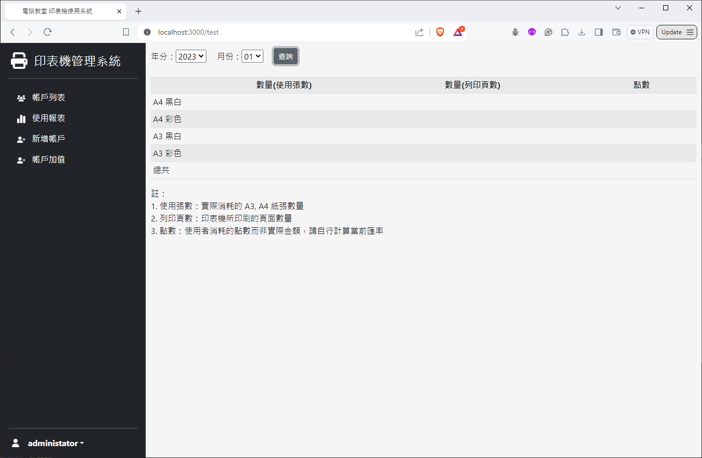

# Printer Account Management System
## Description
Printer Account Management System is a web-based application designed for managing printer usage and user accounts. It facilitates the management of users, printer settings, and printing statistics. The system consists of a Node.js-based server for the frontend developed with Express.js and the backend developed with FastAPI (Python). MySQL is used as the database system provided by XAMPP.

## Features
- User authentication and authorization
- Printer management
- User account management
- Printing settings customization
- Printing statistics tracking
- Price setting for printing services

## Project Status
This project is an incomplete version and serves as a preview of the code and architecture. It may lack certain features or have limited functionality compared to a fully deployed version. The purpose of this repository is to showcase the project's structure, code organization.

Please note that this incomplete version is not intended for production use and may have bugs or unfinished components. 

## Screenshots

### Login
- Login Page

### Client
- Printing Setting Page

### Administrator
- Account Page

- Account Setting Page

- Adding User Page

- Balance Setting Page

- Statistics Page

- Price Setting Page
